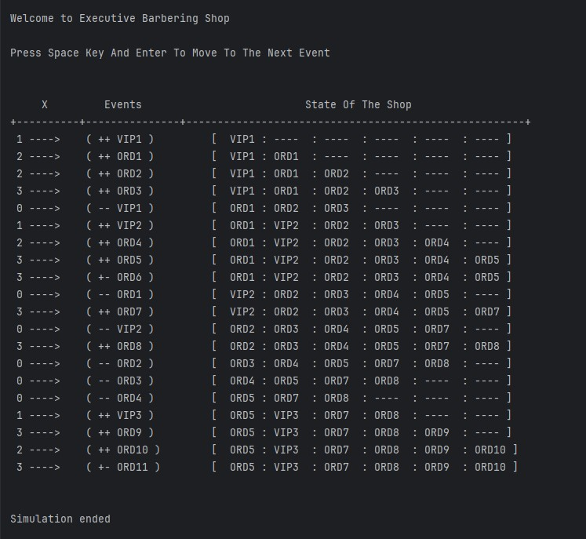

# Project Title
BARBERING SHOP
- Barbering Shop is a simple Java console application that simulates a barbering shop.

## Demo
#### Below Shows A Demo Of the Application after 20 simulations


## Getting Started

These instructions will get you a copy of the project up and running on your local machine for development and testing purposes.

### Prerequisites

What things you need to install the software and how to install them:

- JDK 11 or later
- IntelliJ IDEA 2023.3.6 or any other IDE that supports Java

### Installing and Running

A step by step series of examples that tell you how to get a development environment running:

1. Clone the repository:
    ```
    git clone https://github.com/MawuliB/BarberingShop.git
    ```
2. Navigate to the project directory:
    ```
    cd BarberingShop
    ```
3. Open the project in your preferred IDE (IntelliJ IDEA recommended).
4. Build the project (usually there's a build option in the IDE).
5. Run the main class or the class with the main method.

## Folder Structure

The workspace contains two folders by default, where:

- `src`: the folder to maintain sources
- `lib`: the folder to maintain dependencies


## License

This project is licensed under the MIT License - see the [LICENSE.md](https://github.com/MawuliB/BarberingShop/blob/main/LICENSE.md) file for details